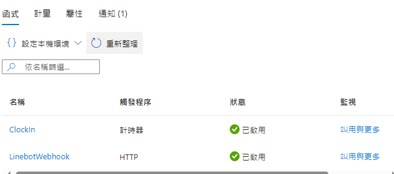

# 🕒 bpClocker - 自動打卡程式

基於 [Azure Function](https://azure.microsoft.com/zh-tw/products/functions) 開發的自動打卡工具，使用 .NET 8 與 Docker，高效又便捷！🚀

主要功能：

- ⏰ 每日 9 點自動打卡：假日自動跳過，不再擔心忘記打卡！(依據 [中華民國政府行政機關辦公日曆表](https://data.gov.tw/dataset/14718) 判斷)
- 📩 打卡結果通知：透過 Email 或 LINE 傳送打卡結果，即時掌握打卡狀態！
  讓打卡變得更輕鬆自動，無須再手動煩惱！

## Quickstart

1. [](https://portal.azure.com/#create/Microsoft.Template/uri/https%3A%2F%2Fraw.githubusercontent.com%2FXuHaoJun%2FbpClocker%2Fmain%2FAzureDeployTemplate.json)點擊 Deploy to Azure 按鈕，會自動建立兩個 Azure 服務:
   - Azure Function(使用 B1 Basic Tier)
   - Azure Container Registry(名字要自己想一個新的，不能使用預設值 bpClocker，因為被我用掉了)。
2. 去 Azure Function 設定環境變數:

   - `WEBSITES_ENABLE_APP_SERVICE_STORAGE=false`
     - 沒設定會讀取不到 functions 列表。
   - `WEBSITE_TIME_ZONE="Asia/Taipei"`
     - 設定台灣時區。
   - `Bp__ApiBase=https://xxxx/ClockIn`
     - 公司打卡網址。
   - `Bp__CardId__0=123456`
     - 你的員工編號，支援多組，`Bp__CardId__1`，`Bp__CardId__2` 以此類推。
   - `LineBot__ChannelSecret=<YOUR_LINE_CHANNEL_SECRET>`
     - 可選，傳送打卡結果，或假日也會傳送今日不打卡。
   - `MimkitConfig__ConnectHost=<YOUR_SMTP_HOST>`
     - 可選，Email 發送設定，Host。
   - `MimkitConfig__ConnectProt=25`
     - 可選，Email 發送設定，Port。
   - `MimkitConfig__UserName=<YOUR_SMTP_USERNAME>`
     - 可選，Email 發送設定，帳號。
   - `MimkitConfig__Password=<YOUR_SMTP_PASSWORD>`
     - 可選，Email 發送設定，密碼。
   - `MimkitConfig__Sender="<YOUR_SMTP_SENDER>"`
     - 可選，Email 發送設定，寄件者。

3. 建置並上傳程式至 Azure Container Registry:

   - ```sh
      # 帳密去你的 Azure Container Registry 看
      docker login <你的bpClocker名稱>.azurecr.io
     ```

   - ```sh
       docker build -f ./src/BpBlockerAzureFunction/Dockerfile -t <你的bpClocker名稱>.azurecr.io/bp-clocker .
     ```

   - ```sh
      docker push <你的bpClocker名稱>.azurecr.io/bp-clocker
     ```

4. 重新啟動 Azure Function，functions 列表應會出現內容。



## Development

Requirement:

1. .net8
2. Azure function cli tool: `func` (`npm i -g azure-functions-core-tools@4 --unsafe-perm true`)

```sh
cd src/BpClockerAzureFunction
func start
```

## CI/CD(Github Actions)

_TODO_ 自動建置程式並上傳至 Azure Container Registry

1. ~~Fork Project~~
2. ~~取得並設定你的 Azure Container Registry 帳密至 Github Actions~~

## Issues

- <https://learn.microsoft.com/en-us/answers/questions/1276258/azure-function-are-not-loaded-at-runtime-after-dep>
